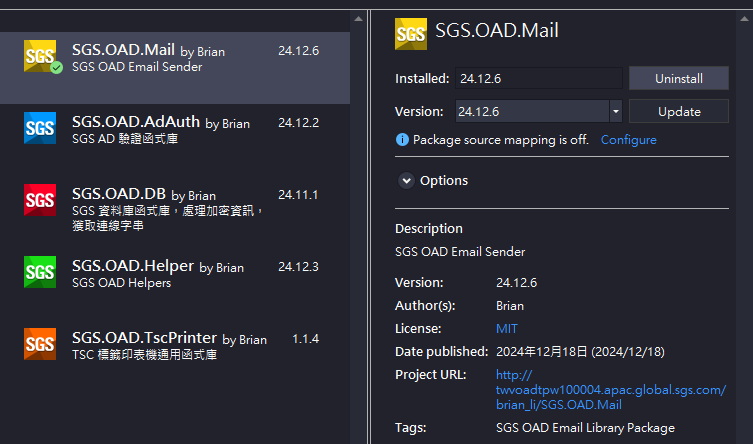
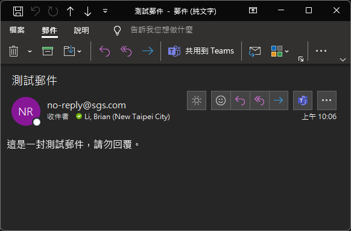

 
 


- 寄送 Email 套件，預設為 SGS 內部常用配置，其餘使用方式後述
- 部署為內部 NuGet Package，依照正常套件使用方式即可

# 📦SGS.OAD.Mail



# ✨How to Use

- 新增內部 Package Source `\\twfs007\SGSSHARE\OAD\nuget\`
  - 可加入 `nuget.config` 組態檔 (建議放置與 `*.sln` 同層)
  - 或於 Visual Studio 2022 `NuGet Package Manager` 新增來源
- 安裝方式與一般 NuGet 套件相同，可透過 CLI 或使用 `NuGet Package Manager`
- 以下說明使用方式

# 🌳Using Namespace

```csharp
using SGS.OAD.Mail;
```

# 🚀Quick Start

```csharp
Email.Create().To("your.email@sgs.com").Send();
```
- 如成功送出，信箱應該會收到一封測試信
- 測試信寄件者為 `no-reply@sgs.com`，例如我寄給自己會像這樣👇🏻



# 📋Full Example

```csharp
Email.Create()
    .From("your.email@sgs.com")
    .To("other.email@sgs.com", "somebody@sgs.com")
    .Cc(new List<string>() { "other.email@sgs.com", "somebody@sgs.com" })
    //.Bcc("other.email@sgs.com", "somebody@sgs.com")
    .Subject("Your Email Subject")
    .Body("<h1>Hello World!</h1>", true)
    .Send();
```

- 更完整的使用範例如上👆🏻
- `收件人`、`副本`、`密件副本` 等支援多種設定方式
- 如信件主體 `Body` 為網頁，記得啟用 `html` 避免編碼異常

# 📬SMTP Configuration

```csharp
Email.Create()
    .UseSmtp("your.smtp.domain", 9527)
    //.WithCredentials("username", "password")
    //.DisableSSL() //預設啟用 SSL，可停用
    .To("someone@sgs.com")
    .Send();
```

- 支援自訂 SMTP 主機，須設定 `host` 與 `port`
- 如需驗證請啟用 `.WithCredentials` 並輸入帳號密碼
- 預設啟用 SSL，如需停用請設定 `.DisableSSL()`

# 📎Attachment

```csharp
Email.Create()
    .To("someone@sgs.com")
    .Attach("path/to/attac.pdf") //附件檔案路徑
    .Send();
```

- `附件檔案` 請設定其路徑，支援多種設定方式
- ⚠️建議於發送之前檢查 `附件檔案` 大小，避免夾帶過大檔案

# 🔄Asynchronous

```csharp
await Email.Create()
    .To("someone@sgs.com")
    .SendAsync();
```

- 支援非同步發送郵件

# 🚨Retry On Failure

```csharp
Email.Create()
    .To("someone@sgs.com")
    .SendWithRetry(); //預設失敗重送 3 次，每次間隔 3 秒

// Asynchronous
await Email.Create()
    .To("someone@sgs.com")
    .SendAsyncWithRetry(2, 5000); //重送 2 次，間隔 5 秒
```

- 支援失敗重送，預設重送 3 次，每次間隔 3 秒
- 失敗重送支援非同步處理，也可自訂重送次數與間隔時間

# 📥Concurrent Processing

```csharp
var list = new List<Email>
{
    Email.Create().To("user1@sgs.com"),
    Email.Create().To("user2@sgs.com")
    // create more email...
};

// Concurrency
await Email.SendMultipleAsync(list);
// Concurrency with retry
await Email.SendMultipleWithRetryAsync(list);
```

- 郵件如包含多位收件人，`SmtpClient` 本身已會一次發送 (包含副本與密件也是)
- 如果有多封郵件，可考慮使用非同步併發模式發送，也支援重試機制